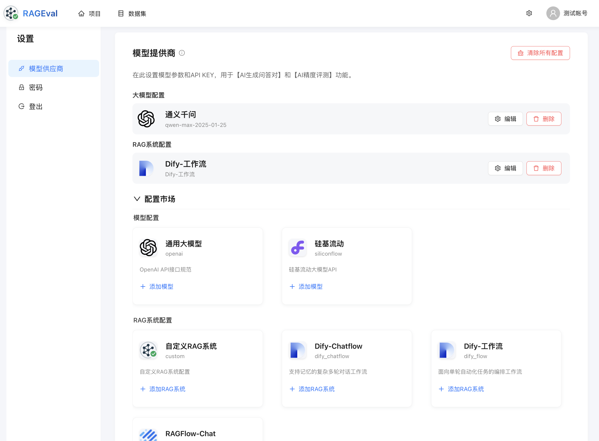
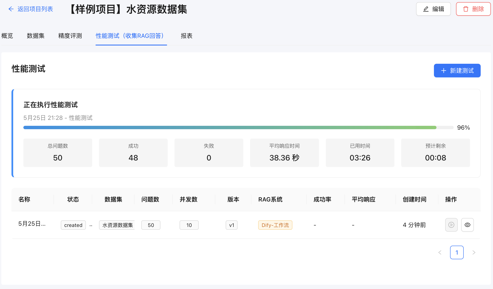
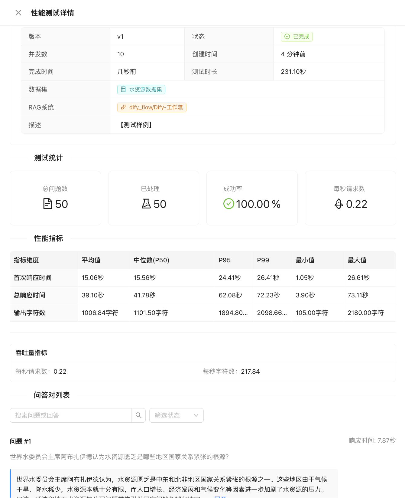
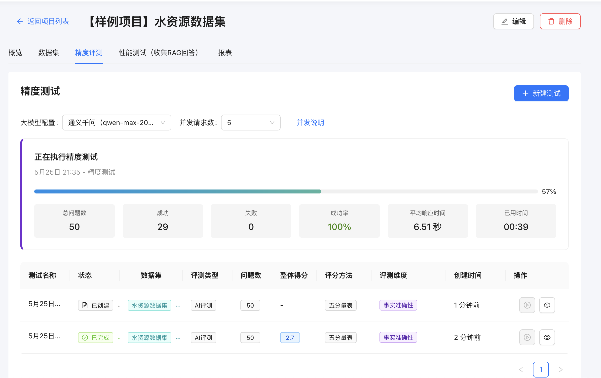
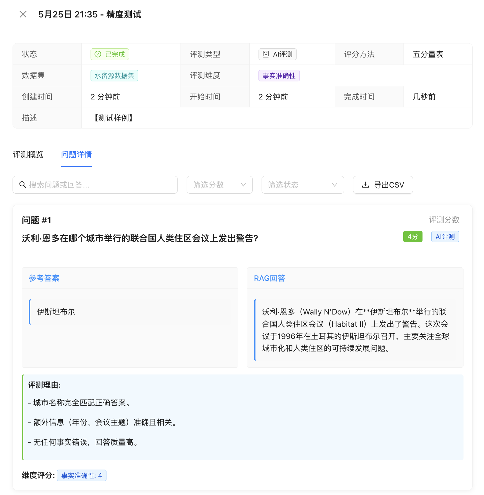
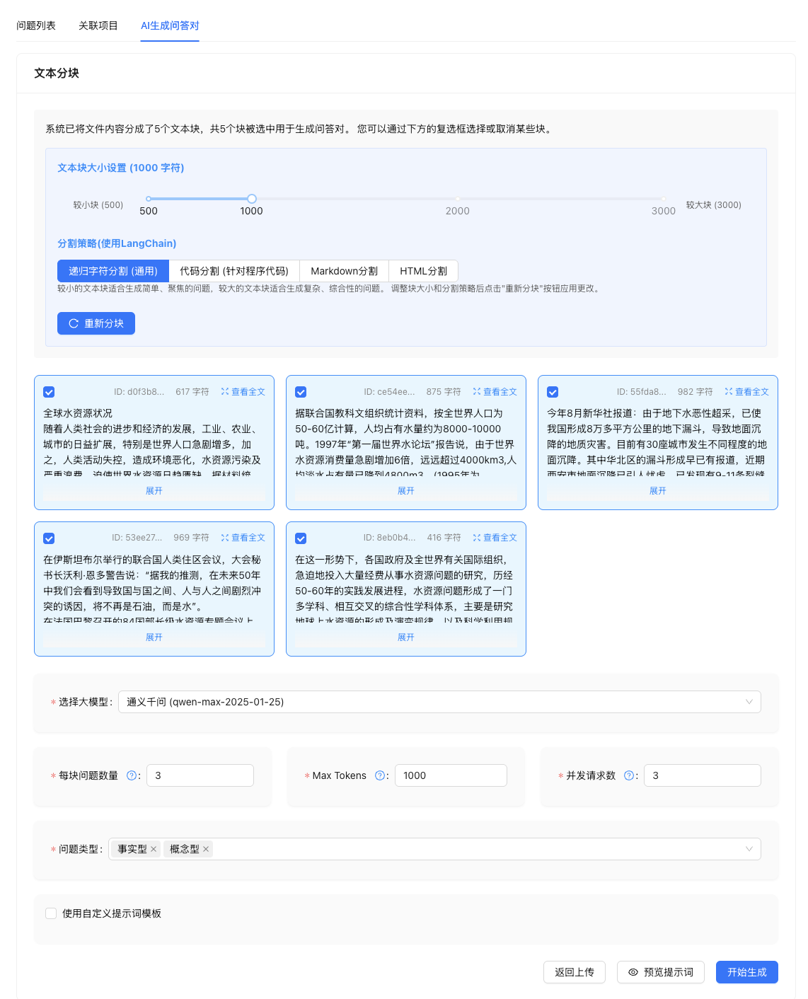
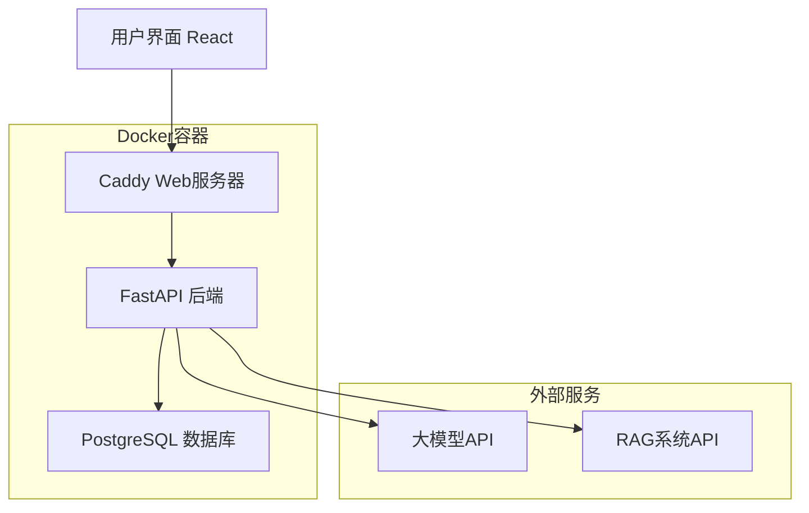

# 🔍 灵鉴 RAG评测系统 | RAGEval 

<div align="center">
  
  
  <h3>✨ 开箱即用的RAG系统自动化评估工具</h3>
  <p><em>One-stop RAG Evaluation Solution</em></p>
  
  [](https://opensource.org/licenses/MIT)
  [](https://www.python.org/)
  [](https://fastapi.tiangolo.com/)
  [](https://www.docker.com/)
  
  <p>
    <a href="#-快速开始">快速开始</a> •
    <a href="#-核心功能">功能特性</a> •
    <a href="#-在线演示">在线演示</a> •
    <a href="#-功能截图">功能截图</a> •
    <a href="#-系统架构">系统架构</a> •
    <a href="#-参与贡献">参与贡献</a>
  </p>
  
  <p>
    <strong>⭐ 如果这个项目对你有帮助，请给我们一个Star！⭐</strong><br>
    <em>您的支持是我们持续改进的动力</em>
  </p>
</div>

---

## 🎯 项目简介

**灵鉴（RAGEval）** 是一款专业的RAG（检索增强生成）系统评测工具，为AI应用开发者提供从数据准备、自动评测到报告生成的**全流程解决方案**。


## 🎬 在线演示

> **🌐 测试网址**：[https://rag-eval.chongwenz.cn](https://rag-eval.chongwenz.cn)
> 
> **👤 测试账号**：`t1@rag.com` / `1`
>
> **📺 演示视频**：[快速介绍视频（该视频版本较旧，4月初的版本）](https://www.bilibili.com/video/BV1XLZtYUEgW/?vd_source=45f48aae0c1bdd4da1e70a2f6913ab60#reply114260122277236)
>


## 🚀 快速开始
> 默认**管理员**账号：`admin@rag.com` / `admin`
### 🐳 一键部署（推荐）

```bash
# 1. 克隆项目
git clone https://github.com/momomo623/RAGEval.git
cd RAGEval

# 2. 启动所有服务
cd docker
docker-compose up -d

# 3. 等待服务启动（约1-2分钟）
docker-compose logs -f

# 4. 访问应用
http://localhost
```

### 🌐 手动部署
```bash
# 1. 克隆项目
git clone https://github.com/momomo623/RAGEval.git
cd RAGEval
# 2. 安装后端依赖
cd rag-evaluation-backend
pip install -r requirements.txt
# 3. 启动后端服务
uvicorn app.main:app --reload --host 0.0.0.0 --port 8000

# 4. 安装前端依赖
cd rag-evaluation-frontend
npm install
# 5. 启动前端服务
npm run dev

# 6. 数据库
手动安装需要自行准备PostgreSQL数据库。然后执行SQL文件进行初始化：docker/sql.sql
后端服务默认：数据库账户密码：postgres/postgres、数据库名：rag_evaluation
后端配置路径：rag-evaluation-backend/app/core/config.py

# 7. 访问应用
http://localhost:5173
```


## 📸 功能截图

### 🔧 系统配置
<div align="center">
  
  <p><em>支持多种大模型API配置和RAG系统接入设置</em></p>
</div>

### ⚡ 性能测试
<div align="center">
  <table>
    <tr>
      <td align="center">
        
        <br><em>实时性能测试监控</em>
      </td>
      <td align="center">
        
        <br><em>详细的性能指标分析</em>
      </td>
    </tr>
  </table>
</div>

### 📊 精度评测
<div align="center">
  <table>
    <tr>
      <td align="center">
        
        <br><em>AI自动精度评测过程</em>
      </td>
      <td align="center">
        
        <br><em>多维度精度评测结果</em>
      </td>
    </tr>
  </table>
</div>

### 🤖AI生成问答对
<div align="center">
  
  <p><em>支持多种数据格式导入和批量生成</em></p>
</div>


## ✨ 核心功能

### 🤖 AI智能评测数据生成
- ✅ **文档解析** - 自动文档切分和预处理
- ✅ **智能问答生成** - 并行调用大模型生成高质量问答对
- ✅ **数据质量保证** - 自动验证生成数据的完整性和准确性
- 🔜 **多样化生成** - 支持不同难度和类型的问答对生成

### 📊 RAG系统精度评测
- ✅ **多维度评估** - 准确性、相关性、完整性等全方位评测
- ✅ **智能评分** - AI自动评分和分析
- ✅ **对比分析** - 多个RAG系统横向对比
- 🔜 **人工评测** - 协作式人工审核平台

### ⚡ RAG系统性能评测
- ✅ **响应时间测试** - 精确测量系统响应延迟
- ✅ **首Token时间** - 测量从请求到首个Token返回的延迟
- ✅ **平均字符时间** - 计算每个字符的平均生成时间
- ✅ **平均响应时间** - 统计完整回答的平均响应时间
- ✅ **并发性能测试** - 模拟并发场景下的系统表现
- ✅ **吞吐量测试** - 单位时间内处理请求数量评估

### 📊 服务说明

| 服务 | 端口 | 说明 | 状态检查 |
|------|------|------|----------|
| 🌐 前端应用 | 80/443 | React + Caddy | `curl http://localhost` |
| 🔧 后端API | 8000 | FastAPI | `curl http://localhost:8000/health` |
| 🗄️ 数据库 | 5432 | PostgreSQL 14 | `docker-compose ps` |

## 🏗️ 系统架构



### 🔧 技术栈

**前端**
- React 18 + TypeScript
- Ant Design + TailwindCSS
- Vite构建工具

**后端**
- FastAPI + Python 3.9+
- SQLAlchemy ORM
- Pydantic数据验证

**部署**
- Docker + Docker Compose
- Caddy Web服务器（自动HTTPS）
- PostgreSQL数据库

## 📖 详细文档

- 📚 [部署指南](docker/README.md) - 详细的Docker部署说明
- 🔧 [后端开发](rag-evaluation-backend/README.md) - 后端API开发指南
- 🎨 [前端开发](rag-evaluation-frontend/README.md) - 前端开发环境配置

## 🗺️ 开发路线图

### ✅ 已完成功能
- [x] 项目管理和数据集管理
- [x] 系统配置和健康检查
- [x] AI问答对生成
- [x] RAG系统性能测试
- [x] RAG系统精度测试
- [x] Docker一键部署
- [x] Caddy自动HTTPS

### 🔜 计划功能
- [ ] 完整的AI评测引擎
- [ ] 报告生成
- [ ] 多语言支持
- [ ] 支持RAG中间过程评测，如召回率等
- [ ] API SDK开发

## 🤝 参与贡献

我们欢迎所有形式的贡献！无论是代码、文档、建议还是bug报告。

### 🌟 如何贡献

1. **⭐ Star本仓库** - 这是对我们最大的支持！
2. **🐛 报告问题** - 在Issues中描述遇到的问题
3. **💡 提出建议** - 分享你的想法和改进建议
4. **🔧 提交代码** - Fork仓库并提交Pull Request


## 📄 开源协议

本项目采用 [MIT License](LICENSE) 开源协议。

---

<div align="center">
  <p>
    <strong>⭐ 觉得有用？给我们一个Star吧！⭐</strong><br>
    <em>您的每一个Star都是我们前进的动力</em>
  </p>
  
  <p>
    Made with ❤️ by the RAGEval Team
  </p>
</div>

## Star History

[](https://www.star-history.com/#momomo623/RAGEval&Date)